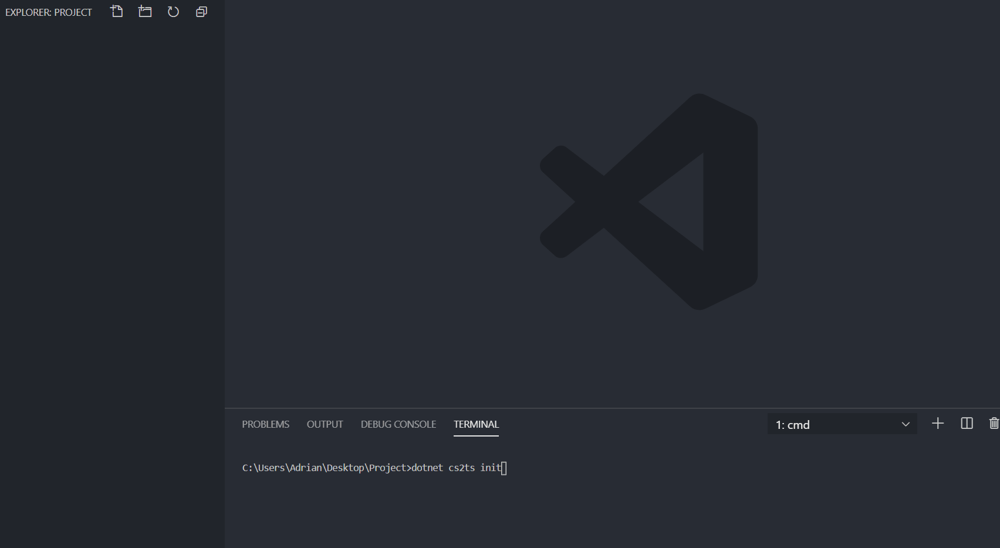

# C# to TypeScript

Convert C# Models, ViewModels and DTOs into their TypeScript equivalents.
**This fork only works with the `cs2tsconfig.json`**

We have **changed the following things**:

- You can specify multiple input fields (from string to array). **take a look at the config file below**

## Installing

```cmd
dotnet tool install --global SysTec.CSharpToTypeScript.CLITool
```

## Usage

```cmd
dotnet csharp2ts
```

\* Simple import generation assumes flat output directory structure and file names corresponding to type names (e.g. `MyType`: `myType.ts`, `my-type.ts`, `my-type.model.ts`).

## Configuration file



To create optional configuration file (`cs2tsconfig.json`) in current directory run:

```cmd
dotnet csharp2ts init
```

### Content

```json
{
  "input": ["."],
  "output": null,
  "useTabs": false,
  "tabSize": 4,
  "skipExport": false,
  "useKebabCase": false,
  "appendModelSuffix": false,
  "clearOutputDirectory": false,
  "angularMode": false,
  "partialOverride": false,
  "preserveCasing": false,
  "preserveInterfacePrefix": false,
  "convertDatesTo": "string",
  "convertNullablesTo": "null",
  "importGeneration": "none",
  "quotationMark": "double"
}
```

## Run on Build

**Sample**: https://github.com/AdrianWilczynski/CSharpToTypeScript/tree/master/samples/RunOnBuild

Add `Exec` task to `.csproj` file.

```xml
<Target Name="CSharpToTypeScript" BeforeTargets="Build">
    <Exec Command="dotnet csharp2ts ./DTOs -o ./Client/models -i Simple -q Single -c" />
</Target>
```
